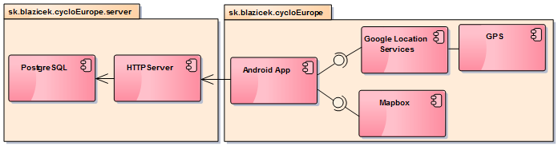
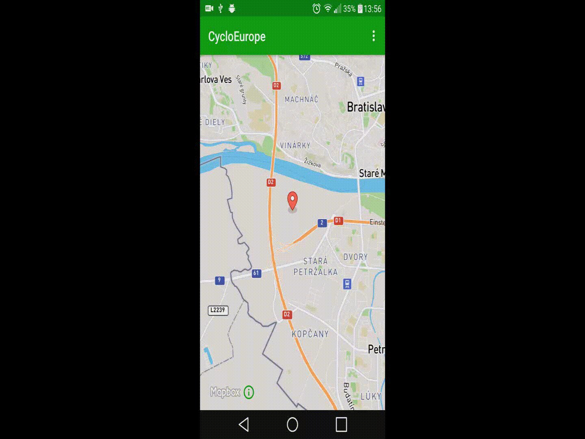
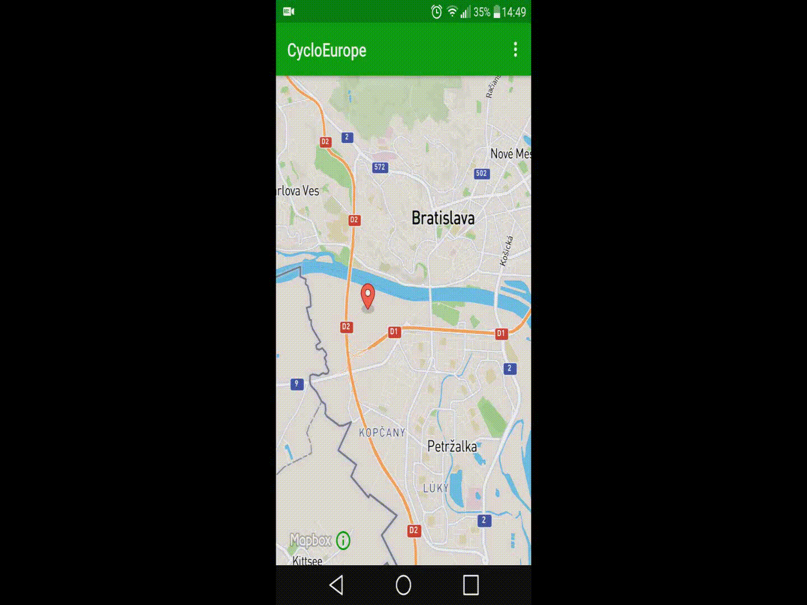
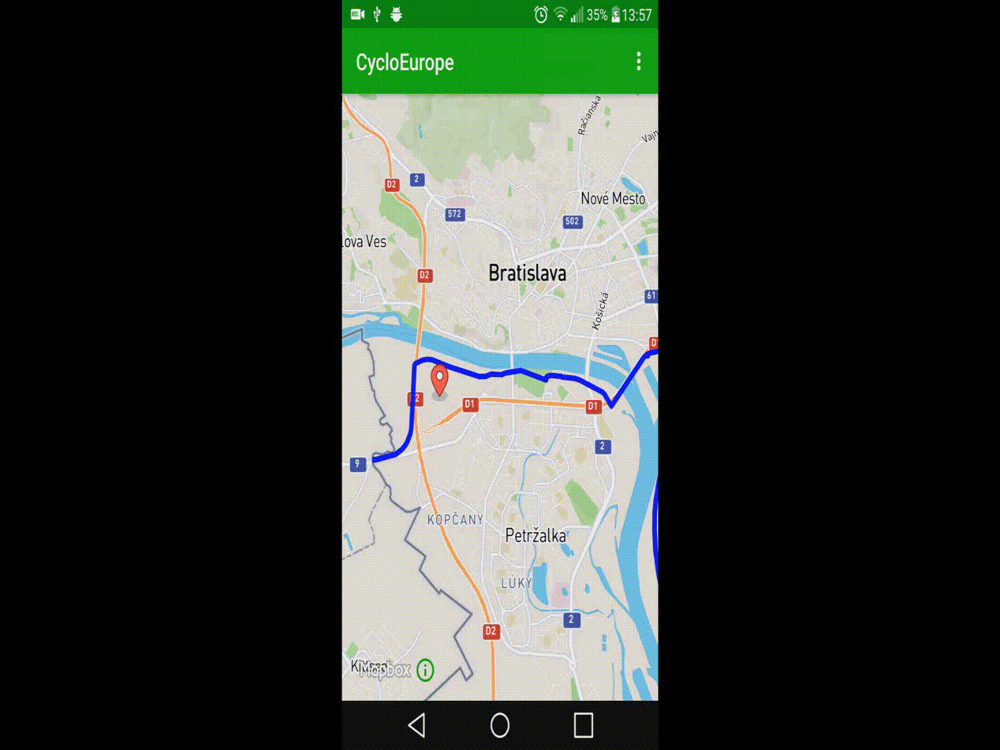
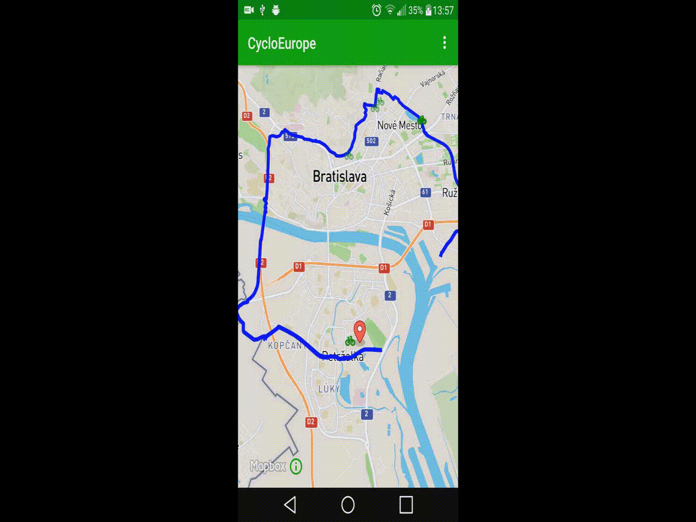
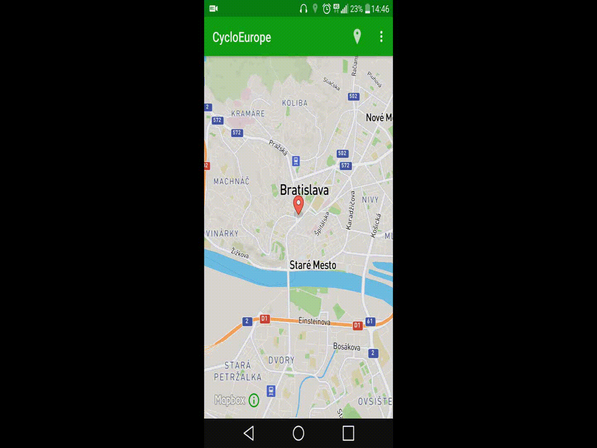

*[SK](README.sk.md)*

[More about Android app](https://github.com/jozef17/Cyclo-Europe/tree/master/CycloEurope%20-%20Android%20App),
[More about Server](https://github.com/jozef17/Cyclo-Europe/tree/master/CycloEurope%20-%20Server)

# CycloEurope

Client - Server application:
- Display users current location (if GPS is available)
- Finds closest cycleway to chosen location
- Finds connecting cycleways to closest cycleway
- Finds Bike Shops, Accommodation or Refreshments near by closest cycleway

# Technical Details
## Android Application
- Uses [MapBox Android SDK](https://www.mapbox.com/android-sdk/)
- Locate server on local network
- Uses device's GPS

## Server
- Connects to geodatabase (PostGIS extension for PostgreSQL)
- Sends response in GEOJSON format

### Closest cycleway to chosen location

### Connecting cycleways to closest cycleway

### Accommodation near by closest cycleway

### Detail

### Current GPS location

