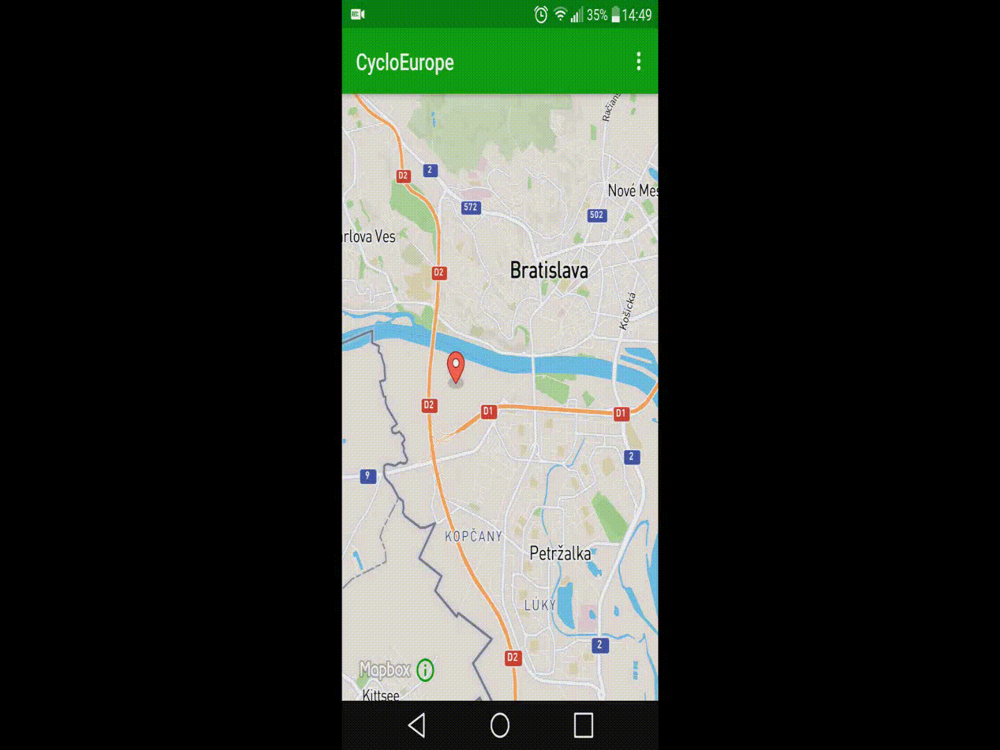
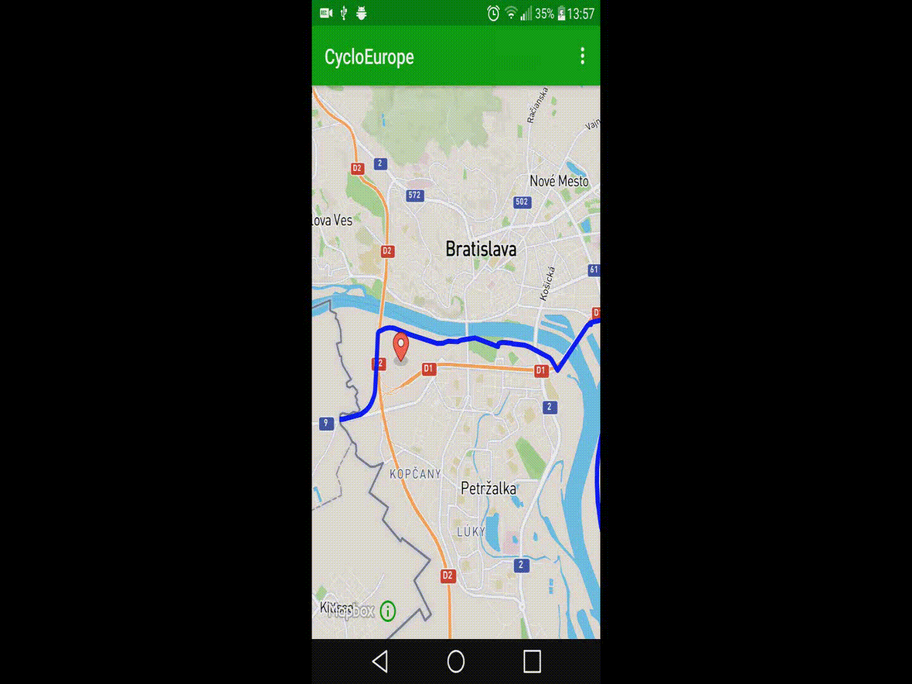

*[EN](README.md)*

[Viac o Android aplik徑ii](https://github.com/jozef17/Cyclo-Europe/tree/master/CycloEurope%20-%20Android%20App) ,
[Viac o servery](https://github.com/jozef17/Cyclo-Europe/tree/master/CycloEurope%20-%20Server)

# CycloEurope

Klient - Server aplik치cia:
- Zobrazenie aktu치lnej polohy pou쮂셨ate쬬 na mape (ak je dostupn칠 GPS)
- N치jdenie najbli쮄면j cyklocesty k zvolenej polohe
- N치jdenie nap치jaj칰cich cyklociest k najbli쮄면j cykleoceste
- N치jdenie cykloobchodov, ubytovania a ob캜erstvenia v okol칤 najbli쮄면j cyklocesty

# Technick칠 podrobnosti
## Android Aplik치cia
- Na zobrazovanie mapy pou쮂셨a [MapBox Android SDK](https://www.mapbox.com/android-sdk/)
- Obsahuje mechanizmus na n치jdenie servera na lok치lnej sieti
- Vyu쮂셨a GPS zariadenia

## Server
- Pristupuje ku geodatab치ze (PostGIS roz코칤renie pre PostgreSQL)
- Odpoved치 na po쬴adavky vo forme GEOJSON spr치v

### Najbli쮄멸a cyklocesta k zvolenej polohe

### Nap치jaj칰ce cyklocesty

### Ubytovanie v okol칤 najbli쮄면j cyklocesty

### Detail

### Aktu치lna poloha pod쬬 GPS

